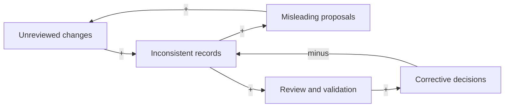

# Research workflow controls

Date: 2026-10-01. Status: design approved by the researcher in issue #6 planning; implementation is governed by the contracts below. This is a harness design, not a study protocol or experimental result.

## System and purpose

The boundary includes evidence intake, agent proposals, researcher review, lifecycle transitions, experiment authorization references, evaluation, and policy changes. Actors are the researcher, proposing agents, maintainers, evidence tools, experiment runner, validators, and UI/playbook consumers. Literature algorithms, execution backends, log storage, UI rendering, and contributor governance remain separate responsibilities. The runner retains ownership of its ledger and logs.

The leverage hypothesis is that explicit ownership, exact revision links, and reviewed changes reduce silent research drift without imposing an impractical review burden. This is a proposed effect, not a demonstrated result. Review latency, evidence verification, experiment completion, and regeneration delays can accumulate; review queues may encourage bypasses. Offline scenario checks should challenge stale approval, concurrent edits, invalid links, rollback, and interrupted application. Undetected protected edits, ambiguous current state, broken provenance, or recurring manual bypasses would disconfirm the proposed benefit.

The following author-generated conceptual causal loop diagram describes harness governance. It does not model the fork's study and is not experimental evidence. Plus means an increase encourages an increase; minus means it encourages a decrease.

The first loop reinforces drift. The second balances it through detection and corrective decisions. The model assumes bounded Git collaboration and available human review; many concurrent writers or a requirement to replay every historical state could change the architecture choice.

## Compared approaches

| Approach | Source tracking | Rollback | Conflicts and offline operation | Tradeoff |
| --- | --- | --- | --- | --- |
| Event log | Actions carry actors, reasons, and exact inputs; replay reconstructs state. | Compensating events preserve earlier actions. | Requires ordering and concurrency rules; a local store can work offline. | Adds event-schema evolution, replay, and projection responsibilities. |
| Linked versioned documents | Structured links connect evidence, hypotheses, and decisions. | Superseding revisions preserve earlier decisions. | Localized file conflicts, with coordinated validation for linked edits; works in Git offline. | Requires uniform metadata and a link resolver. |
| Canonical files plus manifest | Canonical records carry metadata and links; a generated index locates them. | Reviewed new revisions restore earlier content while retaining history. | Conflicts are rejected or explicitly resolved; index rebuilds deterministically offline. | The index must never become another editable source of truth. |

Choose canonical files plus a generated manifest. The two document approaches overlap: the selected records remain linked documents. Git supplies committed history, while dated decisions and retained record revisions explain transitions. See [ADR 0003](../.beryl/agent/adr/0003-research-workflow-controls.md).

## Record contract

Current records live under `docs/workflow/records/`. Each Markdown record starts with a visible fenced JSON metadata block containing `id`, `type`, `status`, `owner`, `revision`, `created_at`, `links`, and `details`. IDs are stable; revisions are positive integers and increment by one on replacement. Links identify a relation, record ID, and exact revision. The human-readable body explains the record. The generated `docs/workflow/manifest.json` indexes current records, their file hashes, links, and active disposition. It contains no independent research decisions.

Drafts and candidates remain visible in the index but are not active research. Active statuses are admitted evidence, accepted claims, open gaps, selected opportunities, approved/under-test hypotheses, approved/active campaigns, authorized/running runs, accepted evaluations, and approved decisions. Retirement overrides active disposition without changing execution status. Record hashes cover exact UTF-8 bytes, including line endings. Approval dependency links can point back to a target; evidence/protocol dependencies cannot form cycles.

Approved campaigns bind `protocol_ref` to `protocol_sha256`; accepted evaluations bind `analysis_ref` to `analysis_sha256`. Terminal run references include `run_id`, `ledger_ref`, `log_ref`, the ledger's `config_hash`, `ledger_row_sha256`, and `log_sha256`. The read-only `run-reference` command derives those fields from existing runner evidence. Changed source artifacts must be reviewed with updated record references; earlier artifacts are retained by digest when needed to resolve historical records.

| Type | Allowed progression | Required detail |
| --- | --- | --- |
| Evidence | captured -> reviewed -> admitted or excluded; admitted may be superseded | source, locator, reading depth, limitations |
| Claim | proposed -> reviewed -> accepted or rejected | statement; evidence links; decision for acceptance |
| Gap | identified -> reviewed -> open -> resolved or dismissed | description; evidence links; reviewed resolution |
| Opportunity | proposed -> reviewed -> selected or declined | description; gap links; selection decision |
| Hypothesis | draft -> approved or rejected; approved -> under_test -> evaluated | statement; evidence links; approval decision |
| Campaign | proposed -> approved or rejected; approved -> active -> completed or cancelled | protocol reference, stopping rules; hypothesis links; approval decision |
| Run | planned -> authorized -> running -> completed, failed, or cancelled | campaign revision, authorization decision; terminal runs reference their existing ledger row and log |
| Evaluation | draft -> reviewed -> accepted or rejected | analysis reference, conclusion; run links; acceptance decision |
| Decision | proposed -> approved or rejected; approved -> superseded | action, reason, target revision links |

New records begin at their first status. An atomic change may create a proposed decision and approve it in a subsequent reviewed change; the decision's metadata does not itself establish human authorization. Scientific conclusions (`supports`, `contradicts`, `inconclusive`) are independent of evaluation status. `completed` means successful execution, not scientific confirmation. Retirement is a separate optional reason and decision reference; it preserves execution status and excludes records from active views. Terminal or retired items never restart silently. A retry is a new run. A reviewed rollback creates a higher revision with restored content and an audit link to the reversal; it does not delete the intervening history.

## Ownership and change authority

| Category | Authority | Rule |
| --- | --- | --- |
| Researcher-owned content | Responsible researcher | Agents prepare drafts and exact change proposals; protected changes require human approval. |
| Generated material | Approved generator and inputs | Rebuild the manifest and artifacts; reject direct edits to the manifest. |
| Agent instructions | Maintainer | Review canonical instruction changes and regenerate tool shims. |
| Safety policies | Responsible policy owner | Require explicit maintainer approval; research-affecting changes also require researcher approval where applicable. |
| Audited history | Authorized producer | Add corrections and superseding records; never edit or erase earlier entries through the workflow. |

Unknown paths fail closed. Results logs and ledger remain runner-owned. The workflow must not hand-edit them. A maintainer and researcher may be the same person, but approval identifies the role being exercised. Human reviewer assignments and protected integration branches are externally owned controls, not guarantees supplied by a Markdown field or Beryl's hash manifest.

## Proposal, review, application, and recovery

1. Prepare an inspectable proposal containing the author, rationale, evidence references, exact replacement text, before hashes, and a snapshot of record/policy inputs. Present a unified diff. Preparing a proposal does not mutate approved files.
2. Validate required metadata, types, state transitions, exact revision links, ownership, source references, immutable history, and generated-index parity. Validate the whole proposed set before accepting any of it.
3. Bind human approval to the canonical proposal digest and the reviewed GitHub commit. Resolve required reviewers from policy in a caller-designated trusted, already reviewed Git base, not an agent-edited working-copy policy. Verify the remote proposal and its source snapshot as well as human review evidence through a read-only adapter. A self-declared approver, a copied review JSON file, a review of another commit, a bot review, a dismissed approval, or unavailable verification cannot authorize application.
4. Recheck the source snapshot and policy immediately before application. Reject concurrent changes, changed evidence, and stale approvals. Conflicts require a new proposal and review rather than automatic semantic merging.
5. Preserve prior record revisions and an audit receipt, apply the reviewed file set, and regenerate the manifest. Use a transaction journal and an exclusive lock. An interrupted application must be recoverable without overwriting subsequent unrelated edits; recovery restores the pre-application state before another change is accepted.
6. To undo a completed change, prepare another proposal with restored content and incremented record revisions. Obtain new approval and append the reversal receipt. Do not reset history or reuse the original authorization.

Offline reads, proposal preparation, and deterministic validation are supported. Verified application requires trusted review evidence; network or credentials failure leaves the proposal pending. Approval does not merge a pull request or publish a report. GitHub review and live branch protection are external acceptance controls and need explicit maintainer configuration. Privileged local filesystem edits can bypass a CLI; acceptance checks and human review remain necessary.

## Retention and synchronization

Retain approved decisions, previous record revisions, proposal receipts, and referenced Git history for the project lifetime and handover. A different retention policy requires an explicit owner decision. Protected refs and backups are an operational responsibility; Git history alone does not preserve uncommitted edits. Avoid participant-identifying material in retained records.

Current study content stays at its existing canonical boundaries. Lifecycle records reference that content rather than creating another study definition. Any actual shared research-fact change follows the complete [synchronization contract](../.beryl/agent/synchronization-contract.md), including generated report artifacts. This harness-governance change does not alter the study question, protocol, metrics, or results and therefore does not trigger report regeneration.

## Public interfaces and acceptance checks

Expose record reading, manifest generation, change validation, proposal preparation, and approved application through a small Python API and CLI. Evidence tools submit source-linked records; the runner supplies existing run IDs and ledger/log references; the UI reads the generated index and sends proposals; the playbook registry references the same record revisions. Consumers do not maintain independent writable copies of lifecycle state.

Acceptance requires deterministic tests for invalid transitions, missing evidence/decision links, duplicate or reused revisions, manifest drift, retired active items, stale inputs, untrusted or changed approvals, reviewed rollback, and interrupted transaction recovery. Use temporary repositories and test-only sources. Preserve existing harness tests, sandbox confinement, fail-closed live execution, and empty study result templates.

## Design sources

- [Issue #6](https://github.com/NUSAISoc/AISoc-researcher/issues/6): requested scope and acceptance criteria.
- [Microsoft Event Sourcing guidance](https://learn.microsoft.com/en-us/azure/architecture/patterns/event-sourcing): replay, compensating events, concurrency, schema evolution, and projection tradeoffs.
- [Git overview](https://git-scm.com/book/en/v2/Getting-Started-What-is-Git%3F) and [git-revert](https://git-scm.com/docs/git-revert): local versioned snapshots and recorded reversals.
- [W3C PROV-DM](https://www.w3.org/TR/prov-dm/): distinguish entities, activities, responsibility, and derivation. Provenance is not proof of scientific validity.
- [GitHub review API](https://docs.github.com/en/rest/pulls/reviews): obtain review state, reviewer identity, and reviewed commit without trusting proposal metadata.

## Implementation verification

Implemented on `feat/6-research-workflow-controls`. The file map below uses the three approved commit boundaries. A file listed again under integration was extended to bind approvals to exact source/content revisions. No changed file falls outside those boundaries.

| Boundary | Files |
| --- | --- |
| 1: Durable design | `docs/00-research-workflow-controls.md`, `docs/README.md`, `.beryl/agent/adr/0003-research-workflow-controls.md`, `.beryl/agent/architecture.md`, `.beryl/agent/design-tree.md`, `.beryl/agent/ubiquitous-language.md` |
| 2: Records and manifest | `workflow/__init__.py`, `workflow/records.py`, `workflow/__main__.py`, `docs/workflow/README.md`, `docs/workflow/manifest.json`, `docs/workflow/records/.gitkeep`, `docs/workflow/history/records/.gitkeep`, `tests/test_workflow_records.py`, `tests/.manifest.sha256`, `.beryl/agent/affected-tests.conf` |
| 3: Reviewed application and integration | `workflow/changes.py`, `workflow/reviews.py`, `workflow/transaction.py`, `workflow/policy.json`, `workflow/README.md`, `tests/test_workflow_changes.py`, `.github/workflows/workflow-controls.yml`, `docs/workflow/.gitignore`, `docs/workflow/history/artifacts/.gitkeep`, `docs/workflow/history/changes/.gitkeep`, `docs/workflow/proposals/.gitkeep`, `CONTRIBUTING.md`, `.github/maintainer-review-checklist.md`; integration extensions to `workflow/records.py`, `workflow/__main__.py`, `tests/test_workflow_records.py`, `tests/.manifest.sha256`, `docs/workflow/README.md`, and this contract |

Verification on 2026-10-01: all 36 workflow tests and all 68 harness tests pass; Markdown sanity, the installed Beryl aggregate gate, manifest parity, base-revision validation against `origin/main`, `git diff --check`, and workflow YAML parsing pass. New tests cover complete approval/reversal, exact reviewed source snapshots and diffs, protocol/log/ledger version binding, stale reviews, unauthorized roles, interrupted recovery, and concurrent edits. The test hash manifest was regenerated for the new and extended tests; original harness assertions were not weakened.

No formatter is configured. The `--development` Beryl gate is inapplicable because this is an installed checkout without its source marker; `check.sh` passes. Browser verification is inapplicable to this CLI change. Live GitHub review verification was tested through deterministic API fixtures, not a real approval or protected-branch mutation. The shipped human reviewer assignments remain empty, so actual application fails closed until maintainers configure them through review. Study shared facts and report source/artifact hashes are unchanged; report regeneration is not applicable. Temporary session state is cleared after completion.
